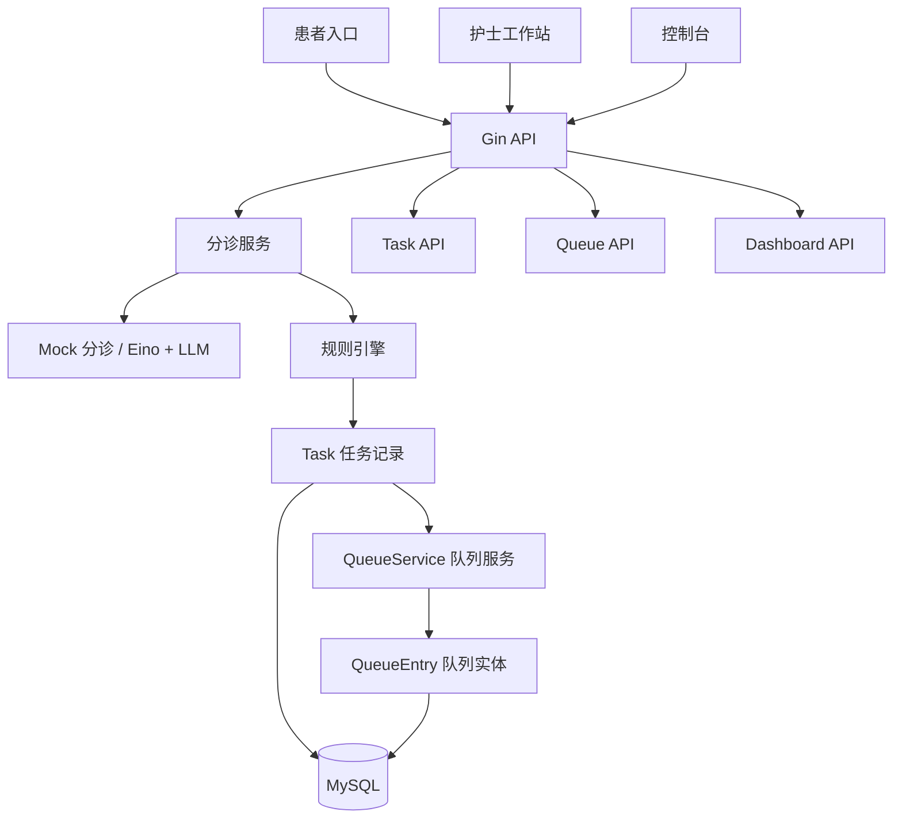
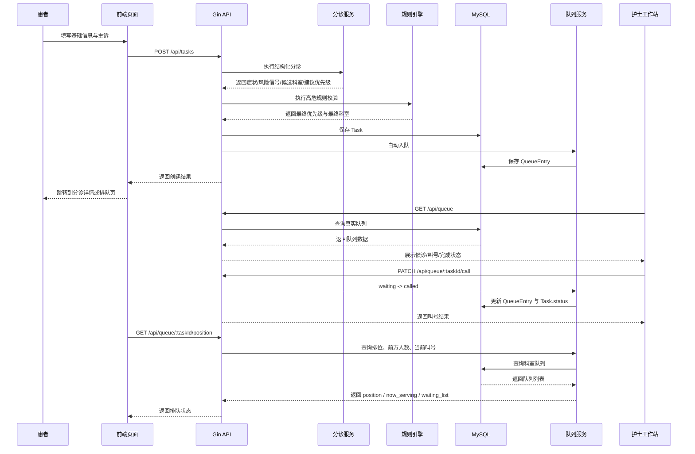

# TriageFlow

一个基于 LLM 的门诊预检分诊与队列管理 Demo，使用 Go、React、规则引擎实现。

TriageFlow 面向门诊场景，重点解决“患者信息采集、主诉结构化理解、分诊安全兜底、候诊排队管理”这一整条链路。  
它是一个**预检分诊与分流系统原型**，不是诊断系统，也不替代医生决策。

## 项目简介

当前版本已经实现了一条可演示的完整业务流程：

- 患者填写基础信息和主诉
- 后端通过以下两种方式之一进行结构化分诊：
  - Mock 关键词匹配分诊
  - 基于 Eino + Claude 的真实 LLM 分诊
- 规则引擎对高危情况进行安全兜底
- 生成最终科室与最终优先级
- 自动写入真实后端队列
- 护士端基于真实队列进行叫号与完成接诊
- 患者端查看自己的排队状态、前方人数和当前叫号情况

## 当前已实现功能

### 1. 多入口前端

- 门户首页
- 控制台
- 护士工作站
- 患者挂号入口
- 患者排队查询页

### 2. 患者信息采集

当前表单支持：

- 患者姓名
- 主诉
- 年龄
- 性别
- 体温
- 疼痛等级
- 特殊情况

### 3. 分诊能力

- Mock 分诊服务
  - 基于关键词提取症状
  - 输出候选科室和建议优先级
- 真实 LLM 分诊服务
  - 基于 Eino 调用 Claude 模型
  - 输出结构化 JSON
- 支持 Mock / LLM 配置切换

### 4. 规则引擎安全兜底

当前已覆盖的典型规则包括：

- 胸痛
- 呼吸困难
- 意识障碍
- 中风样表现
- 大出血
- 抽搐
- 严重过敏
- 中毒
- 急腹症
- 严重创伤
- 高热
- 婴幼儿优先
- 剧烈疼痛

### 5. 队列模型

- 自动入队
- 独立队列状态
- 后端统一排序
- 患者排位查询
- 护士叫号 / 完成

### 6. 护士端能力

- 查看真实队列
- 按状态筛选队列
- 叫号
- 完成接诊

### 7. 患者端能力

- 提交挂号信息
- 查看所属科室
- 查看前方人数
- 查看当前叫号列表
- 查看候诊列表

### 8. 控制台能力

- 任务总览
- 分诊统计
- 规则覆盖统计
- 任务列表
- 分诊详情页

### 9. 国际化

- 简体中文
- 英文

## 技术框架

## 前端

- React 19
- React Router
- Ant Design
- Axios
- Vite
- Vitest
- Testing Library

## 后端

- Go
- Gin
- GORM
- MySQL

## AI / LLM

- CloudWeGo Eino
- `eino-ext` 的 Claude 集成能力
- 支持 Mock / 真实 LLM 双模式切换

## 当前架构说明

### 总体处理流程



### 处理时序图



### 分层结构

后端分为以下几个部分：

- `handler/`
  - HTTP 接口层
  - 包含任务、看板、队列相关 API
- `service/`
  - 核心业务逻辑
  - 包含 Mock 分诊、规则引擎、队列服务
- `llm/`
  - 基于 Eino 的真实 LLM 分诊实现
- `model/`
  - GORM 数据模型
  - 包含任务、队列、分诊结果结构
- `config/`
  - 配置加载
  - 数据库初始化

前端主要模块包括：

- `components/TaskForm.jsx`
  - 患者挂号与信息采集
- `components/TaskList.jsx`
  - 控制台任务列表
- `components/TriageDetail.jsx`
  - 分诊详情页
- `components/NursePortal.jsx`
  - 护士队列操作页面
- `components/PatientQueue.jsx`
  - 患者排队页
- `components/QueueBoard.jsx`
  - 队列展示板
- `hooks/usePolling.js`
  - 轮询刷新逻辑

## 队列模型说明

### 队列实体

`QueueEntry` 当前包含：

- `task_id`
- `patient_name`
- `department`
- `priority`
- `queue_status`
- `queue_number`
- `queue_order`
- `called_at`
- `completed_at`
- `chief_complaint`

### 队列排序规则

排序逻辑统一在后端完成：

- 按科室分队列
- 同一科室内：
  - `urgent` 优先
  - `high` 次之
  - `normal` 最后
- 同优先级按更早入队时间排前面

### 队列状态流转

当前支持：

- `waiting`
- `called`
- `completed`

并且会与 `Task.status` 联动：

- `waiting` 对应候诊中
- `called` 时任务变为 `in_progress`
- `completed` 时任务变为 `completed`

## 安全设计原则

项目采用“AI 理解 + 规则引擎兜底”的设计：

- LLM / Mock 分诊服务负责：
  - 结构化理解主诉
  - 提取症状
  - 提取风险信号
  - 生成候选科室
  - 给出建议优先级
- 规则引擎负责：
  - 高危症状识别
  - 数值型规则覆盖
  - 年龄相关规则覆盖
  - 输出最终优先级与最终科室

这样可以避免完全依赖 LLM 输出，提升分诊安全性。

## 目录结构

```text
TriageFlow/
├─ backend/
│  ├─ config/
│  ├─ handler/
│  ├─ llm/
│  ├─ model/
│  ├─ service/
│  ├─ config.json
│  └─ main.go
├─ frontend/
│  ├─ src/
│  │  ├─ api/
│  │  ├─ components/
│  │  ├─ hooks/
│  │  ├─ locales/
│  │  └─ __tests__/
│  └─ package.json
├─ TODO.md
└─ README.md
```

## 快速开始

## 环境要求

- Go 1.21+
- Node.js 18+
- MySQL 8

## 1. 创建数据库

```sql
CREATE DATABASE IF NOT EXISTS triageflow;
CREATE DATABASE IF NOT EXISTS triageflow_test;
```

## 2. 配置后端

后端配置文件位于：

- [backend/config.json](./backend/config.json)

需要配置的内容包括：

- MySQL 连接
- 是否启用真实 LLM 分诊
- LLM 对应的模型参数

本地开发建议：

- 默认优先关闭真实 LLM，先用 Mock 模式跑通流程
- 不要提交真实 API Key 到仓库

## 3. 启动后端

```bash
cd backend
go mod tidy
go run main.go
```

后端默认地址：

- `http://localhost:8080`

## 4. 启动前端

```bash
cd frontend
npm install
npm run dev
```

前端默认地址：

- `http://localhost:5173`

Vite 已配置 `/api` 代理到后端。

## API 概览

### 任务接口

- `POST /api/tasks`
- `GET /api/tasks`
- `GET /api/tasks/:id`
- `PATCH /api/tasks/:id/status`

### 看板接口

- `GET /api/dashboard`

### 队列接口

- `GET /api/queue`
- `GET /api/queue/:taskId/position`
- `PATCH /api/queue/:taskId/call`
- `PATCH /api/queue/:taskId/complete`

## 测试

## 后端

```bash
cd backend
go test ./... -v
```

当前后端测试覆盖包括：

- 规则引擎测试
- 任务 handler 测试
- 队列 service 测试
- 队列 handler 测试
- LLM 集成测试

注意：

- 当前 LLM 集成测试可能会真实访问外部模型
- 更适合公开仓库的做法，是将其改成可选的集成测试，而不是默认单元测试的一部分

## 前端

```bash
cd frontend
npm test
npm run build
```

## 安全说明

TriageFlow 是一个门诊预检分诊与分流 Demo。

它**不负责**：

- 疾病诊断
- 治疗方案制定
- 替代医护人员决策

所有高风险情况都应由专业医护人员进一步评估和处理。
